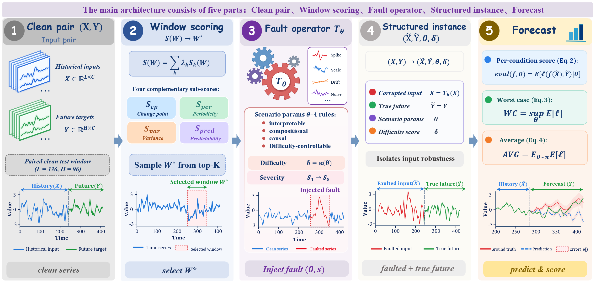
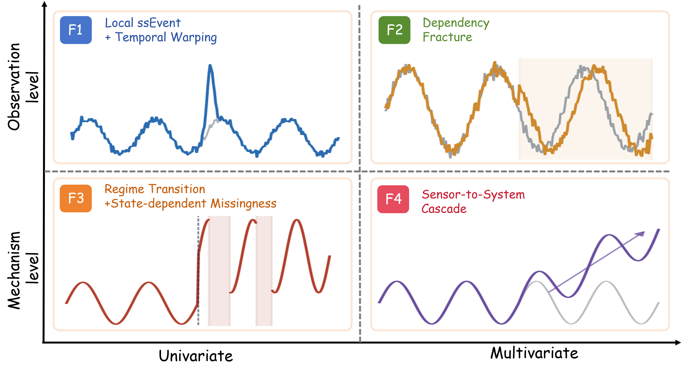
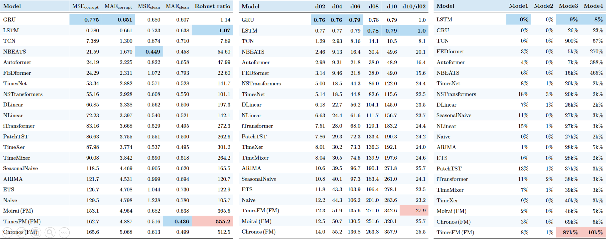
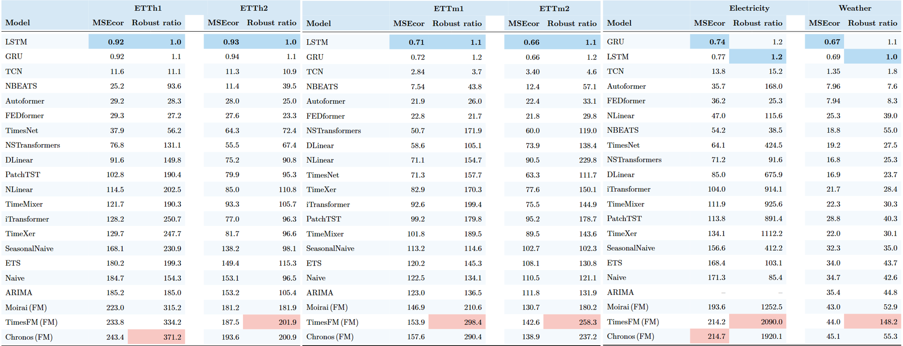
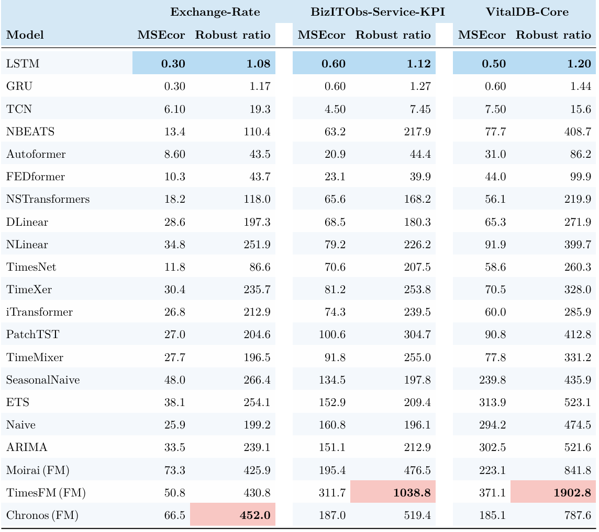
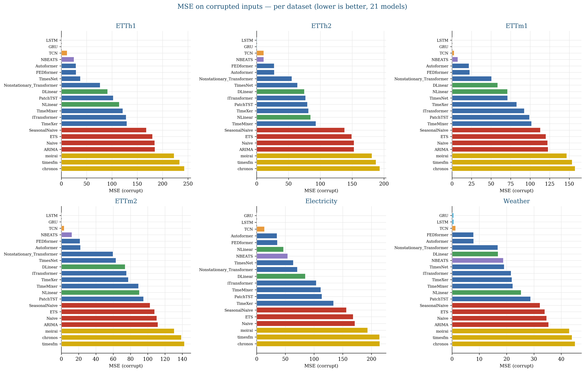
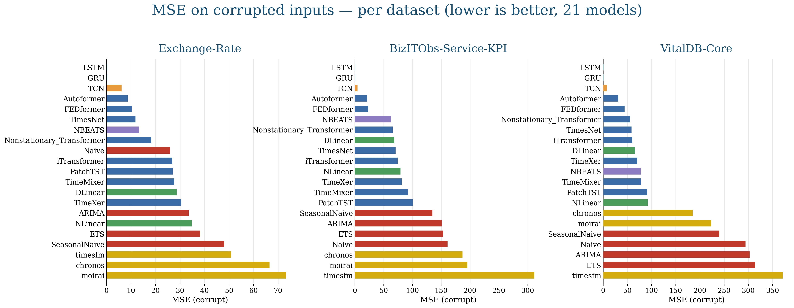

<div align="center">

# ⚡ TS-Fault

### Benchmarking Time Series Forecasters Against Structural Faults

**Yuyang Zhao**¹ · **Lian Xu**² · **Hao Miao**³ · **Chenxi Liu**⁴ · **Hao Xue**¹ ✉

<sub>¹ Hong Kong University of Science and Technology (Guangzhou) &nbsp;·&nbsp; ² The University of Western Australia &nbsp;·&nbsp; ³ The Hong Kong Polytechnic University &nbsp;·&nbsp; ⁴ CAIR, Hong Kong Institute of Science & Innovation, Chinese Academy of Sciences</sub>

<samp>21 models &nbsp;·&nbsp; 9 datasets / 6 domains &nbsp;·&nbsp; 4 failure modes &nbsp;·&nbsp; 5 severity levels &nbsp;·&nbsp; ~3,800 evaluated cells</samp>

<sub>
  <a href="#-why-ts-fault">Why</a> &nbsp;•&nbsp;
  <a href="#-the-four-failure-modes">Failure modes</a> &nbsp;•&nbsp;
  <a href="#-repository-contents">Repository</a> &nbsp;•&nbsp;
  <a href="#-datasets-clean-originals">Datasets</a> &nbsp;•&nbsp;
  <a href="#-quick-start">Quick start</a> &nbsp;•&nbsp;
  <a href="#-results">Results</a> &nbsp;•&nbsp;
  <a href="#-extended-experiments">Extended experiments</a> &nbsp;•&nbsp;
  <a href="#-reproducibility">Reproducibility</a> &nbsp;•&nbsp;
</sub>

</div>

---

> **TL;DR — Clean-data leaderboards do not predict robustness.**
> TS-Fault stops treating faults as i.i.d. noise. It injects **four structurally-coupled failure modes** — abstracted from the anatomy of real grid-scale failures — into the **input window** of nine standard forecasting datasets across six domains, then measures how far each model degrades. Under the two *mechanism-level* modes, the ranking is **reordered**: state-of-the-art Transformers and foundation models collapse, while a plain **LSTM/GRU** — or even a naïve baseline — becomes the most robust.

<div align="center">
  
  <br>
  <em>The TS-Fault pipeline. A clean pair <code>(X, Y)</code> is turned into a structured instance: a window-importance score selects the prediction-critical window <code>W★</code>, a parameterized fault operator <code>T<sub>Θ</sub></code> acts there at a chosen severity, and the scenario parameters <code>Θ</code> and difficulty <code>δ</code> are reported with the instance and used to condition evaluation.</em>
</div>

---

## 📌 Why TS-Fault?

For two decades, long-horizon forecasting progress has been measured by **one number** — average error on clean, complete, evenly-sampled held-out data — under the implicit assumption that it predicts deployed reliability. Real faults are not white noise. They are *structured events*: a transient with onset–peak–decay, a silently broken cross-variable dependency, a regime change coupled with block-missingness, a fault cascading through a sensing pipeline. None of these can be expressed by i.i.d. perturbations, no matter how the variance or masking rate is tuned.

TS-Fault changes the **object of evaluation**, replacing the clean test pair `(X, Y)` with a structured instance `(X̃, Ỹ, Θ, δ)` produced by an explicit, parameterized fault operator. Because `Θ` is exposed, a model's degradation can be attributed to a **named mechanism** at a **tunable severity** — turning a pass/fail noise test into an ablation-style diagnostic tool.

### Headline findings

<table>
<tr>
<td width="50%" valign="top">

**1 · Clean accuracy _anti_-correlates with robustness**
Spearman ρ = **−0.544** (p = 0.011) across all 21 models — and **−0.509** over the 18 non-foundation models, so foundation models *strengthen* the effect.

</td>
<td width="50%" valign="top">

**2 · Stratified by mode**
Observation-level faults preserve the ranking (ρ > **0.92**); mechanism-level faults destroy it (ρ < **0.06**).

</td>
</tr>
<tr>
<td width="50%" valign="top">

**3 · Catastrophe is structural**
All **884** catastrophic failures (≥ 10× error inflation) fall in the two mechanism-level modes; Modes I/II never trigger one.

</td>
<td width="50%" valign="top">

**4 · Strong, but fragile**
TimesFM is **2nd** on clean MSE yet the **worst** of all 21 on robustness (ratio ≈ **555**).

</td>
</tr>
</table>

---

## 🧩 The four failure modes

Each mode corrupts **only the lookback window** (`L = 336`); the forecast target (`H = 96`) is **never** touched, so degradation isolates the cost of a corrupted history. A single difficulty scalar `d ∈ {0.2, 0.4, 0.6, 0.8, 1.0}` (written `d02 … d10`) sweeps severity monotonically. The modes span a **2 × 2 taxonomy** — *observation- vs. mechanism-level* × *univariate vs. multivariate* — and form a constructive minimum: omitting any one renders an entire class of deployment failure invisible.

<div align="center">
  
</div>

| File | Mode | Taxonomy cell | What breaks | Real-world analogue |
|:---|:---|:---|:---|:---|
| `Mode1.py` | **I · Time-Warped Shock** | Observation × Univariate | a shaped transient (onset–peak–decay) + a local time-warp | demand spike / brief sensor glitch |
| `Mode2.py` | **II · Dependency-Fracture Shock** | Observation × Multivariate | cross-channel lead–lag and gain silently falsified; each series alone still looks plausible | regions that usually co-move decouple |
| `Mode3.py` | **III · Regime-Transition Missingness** | Mechanism × Univariate | a regime switch + state-dependent block-missingness around the transition *(hardest mode)* | grid emergency / firm load shed |
| `Mode4.py` | **IV · Cascading Sensor-to-System Failure** | Mechanism × Multivariate | an upstream drift propagates downstream with a lag, inducing secondary dropouts | a fault cascading through coupled subsystems |

> **Observation-level (I, II)** corrupt observations while the data-generating process stays intact → *mild*.
> **Mechanism-level (III, IV)** rewrite the process itself → *severe*, and account for **100%** of catastrophic failures.


---

## 📂 Repository contents

This repository ships the **data-generation pipeline, model implementations, evaluation drivers, trained checkpoints, and the complete results workbook**. The four fault generators are included in full, so the perturbed dataset can be regenerated from scratch.

```
.
├── README.md
├── requirements.txt
│
├── benchmark.py                 # benchmark orchestration helpers
├── dataset_loader.py            # load + normalise the clean CSVs into windows
├── window_selector.py           # select the anchor lookback / horizon windows
│
├── Mode1.py                     # Fault Mode I   — Time-Warped Shock
├── Mode2.py                     # Fault Mode II  — Dependency-Fracture Shock
├── Mode3.py                     # Fault Mode III — Regime-Transition Missingness
├── Mode4.py                     # Fault Mode IV  — Cascading Sensor-to-System Failure
├── run_TS-Fault.py              # ▶ MAIN entry point: build the perturbed benchmark
│
├── classical_models.py          # statistical / linear / recurrent / conv. forecasters
├── foundation_models.py         # TimesFM / Chronos / Moirai (zero-shot wrappers)
├── eval_classical_phase1.py     # evaluate classical + baseline models → results CSV
├── eval_foundation_phase1.py    # evaluate foundation models → results CSV
├── checkpoints/                 # released trained weights
├── ablation_placement.py        # window-placement ablation: top-K S(W) vs random vs anti-selected
├── ablation_lambda.py           # one-at-a-time sensitivity of the S(W) weights λ
├── adapt_foundation.py          # LP / FT / FT-fault adaptation of the three foundation models
├── compose_faults.py            # ⊛ compound faults: T_B ∘ T_A at matched severity
└── figures/                     # paper figures used in this README
```

### The 21 evaluated forecasters

The paper evaluates **21 models** across **six methodological families**, so the conclusions are not an artifact of a single inductive bias:

| Family | Models |
|:---|:---|
| **Statistical** (4) | Naive · SeasonalNaive · ARIMA · ETS |
| **Linear / lightweight** (3) | DLinear · NLinear · N-BEATS |
| **Recurrent / convolutional** (3) | LSTM · GRU · TCN |
| **Decomposition Transformer** (2) | Autoformer · FEDformer |
| **Attention / SOTA** (6) | PatchTST · iTransformer · TimeXer · TimeMixer · TimesNet · Nonstationary-Transformer |
| **Foundation, zero-shot** (3) | TimesFM · Chronos · Moirai |

*Statistical, linear, and recurrent/convolutional models live in `classical_models.py`; the eight Transformer-family models are trained via the [Time-Series-Library](https://github.com/thuml/Time-Series-Library) (see [§ Transformer-family](#-evaluating-the-transformer-family-models)); the three foundation models run strictly zero-shot via `foundation_models.py`. The repository's `classical_models.py` additionally bundles a few exploratory baselines (e.g. RandomForest, XGBoost) that fall outside the 21-model paper subset.*

---

## 📊 Datasets (clean originals)

TS-Fault perturbs **nine** long-horizon datasets spanning **six domains** — energy, load, climate, finance, IT/Ops, and healthcare — deliberately chosen to cover a wide range of **dimensionality** (7 → 321 channels) and **granularity** (5-second → daily). Every clean window is a **length-336 history** and a **length-96 target**. We do **not** redistribute the raw data — download it and place each file at the path the loader expects.


| Dataset | Domain | Channels | Granularity | Size | Path expected |
|:---|:---|:---:|:---|:---|:---|
| ETTh1 / ETTh2 | Energy | 7 | hourly | 17,420 | `dataset/ETT-small/ETTh1.csv`, `…/ETTh2.csv` |
| ETTm1 / ETTm2 | Energy | 7 | 15-min | 69,680 | `dataset/ETT-small/ETTm1.csv`, `…/ETTm2.csv` |
| Electricity (ECL) | Load | 321 | hourly | 26,304 | `dataset/electricity/electricity.csv` |
| Weather | Climate | 21 | 10-min | 52,696 | `dataset/weather/weather.csv` |
| Exchange-Rate | Finance | 8 | daily | 7,588 | `dataset/exchange_rate/exchange_rate.csv` |
| BizITObs-Service-KPI | IT / Ops | 72 | 10-sec | 8,835 | `dataset/bizitobs/service_kpi.csv` |
| VitalDB-Core | Healthcare | 8 | 5-sec | 962 cases | `dataset/vitaldb/vitaldb_core.csv` |

<details>
<summary><b>Download links (canonical)</b></summary>

**The first seven, one bundle (recommended)** — official Time-Series-Library mirror on HuggingFace (CC BY 4.0): <https://huggingface.co/datasets/thuml/Time-Series-Library>

```python
from huggingface_hub import hf_hub_download
for f in ["ETT-small/ETTh1.csv", "ETT-small/ETTh2.csv",
          "ETT-small/ETTm1.csv", "ETT-small/ETTm2.csv",
          "electricity/electricity.csv", "weather/weather.csv",
          "exchange_rate/exchange_rate.csv"]:
    hf_hub_download("thuml/Time-Series-Library", f, repo_type="dataset")
```

* **ETT only (original source):** <https://github.com/zhouhaoyi/ETDataset>
* **Exchange-Rate (original source):** Lai et al., SIGIR 2018 — <https://github.com/laiguokun/multivariate-time-series-data>
* **BizITObs (IT/Ops):** Palaskar et al., AAAI 2024 — <https://huggingface.co/datasets/ibm-research/BizITObs>
* **VitalDB (healthcare):** Lee et al., *Scientific Data* 2022 — <https://vitaldb.net/dataset/>
* **TSLib data instructions:** <https://github.com/thuml/Time-Series-Library>

</details>

---

## 🚀 Quick start

### 1 · Install

```bash
git clone https://github.com/Ray-zyy/TS-Fault.git
cd TS-Fault
pip install -r requirements.txt
```

### 2 · Get the clean datasets

Download the nine CSVs (see [§ Datasets](#-datasets-clean-originals)) into:

```
dataset/ETT-small/{ETTh1,ETTh2,ETTm1,ETTm2}.csv
dataset/electricity/electricity.csv
dataset/weather/weather.csv
dataset/exchange_rate/exchange_rate.csv
dataset/bizitobs/service_kpi.csv
dataset/vitaldb/vitaldb_core.csv        # written by prepare_vitaldb.py
```

### 3 · Generate the perturbed benchmark

`run_TS-Fault.py` slides the anchor windows (`window_selector.py`), loads & normalises the clean series (`dataset_loader.py`), and applies each of the four fault modes (`Mode1.py … Mode4.py`) across all five difficulties:

```bash
python run_TS-Fault.py \
    --data_root ./dataset \
    --out ./TS-Fault_output \
    --n_windows 20
```

This writes one `.npz` per `(dataset, Mode, difficulty)` to `TS-Fault_output/<Dataset>/<Dataset>_Mode<k>_d<dd>.npz` — **`9 datasets × 4 modes × 5 difficulties = 180 files`**, each containing:

| array | shape | meaning |
|:---|:---|:---|
| `x_clean` | `(N, 336, C)` | clean lookback windows |
| `x_corrupt` | `(N, 336, C)` | perturbed lookback windows |
| `y_target` | `(N, 96, C)` | forecast target (**never** perturbed) |

### 4 · Evaluate

**Classical / baseline models** (deep ones train once per dataset on clean windows; statistical ones need no training):

```bash
python eval_classical_phase1.py \
    --models Naive SeasonalNaive ARIMA ETS \
             DLinear NLinear NBEATS \
             LSTM GRU TCN \
    --npz_root ./TS-Fault_output \
    --out ./results/eval_classical.csv --gpu 0 --resume
```

**Foundation models** (zero-shot — see [§ Foundation models](#-installing-the-foundation-models)):

```bash
python eval_foundation_phase1.py \
    --models timesfm chronos moirai \
    --npz_root ./TS-Fault_output \
    --out ./results/eval_foundation.csv --gpu 0 --resume
```

Each evaluator emits the **canonical wide schema**, one row per `(model, dataset, Mode, difficulty)`:

```
model, dataset, Mode, difficulty, mse_corrupt, mae_corrupt, mse_clean, mae_clean, n_samples, time_sec
```

`mse_clean` is the error on the clean input window, `mse_corrupt` on the perturbed window — **both predicting the same untouched target**. The **robustness ratio** `r = mse_corrupt / mse_clean` isolates the cost of corrupted history; `r = 1` is perfect robustness and `r ≥ 10` is a **catastrophic failure**. Concatenate the per-group CSVs (classical + foundation + the TSLib Transformer rows) into the master workbook **`eval_results_full.xlsx`** (also mirrored as the flat `eval_results_full_23.csv`).

---

## 🧪 Evaluating the Transformer-family models

The eight Transformer/attention models (PatchTST, iTransformer, Autoformer, FEDformer, Nonstationary-Transformer, TimeMixer, TimeXer, TimesNet) are trained and run with the **[Time-Series-Library](https://github.com/thuml/Time-Series-Library)** (TSLib).

1. Clone TSLib and place the same nine clean CSVs under its `./dataset/`.
2. Train / evaluate each model with `run.py` under the TS-Fault protocol (`seq_len=336`, `pred_len=96`, `features=M`, MSE loss). Example:

   ```bash
   python -u run.py \
       --task_name long_term_forecast --is_training 1 \
       --root_path ./dataset/ETT-small/ --data_path ETTh1.csv \
       --model_id ETTh1_336_96 --model PatchTST --data ETTh1 \
       --features M --seq_len 336 --label_len 48 --pred_len 96 \
       --e_layers 2 --d_layers 1 --enc_in 7 --dec_in 7 --c_out 7 \
       --train_epochs 10 --batch_size 32 --learning_rate 1e-4 --itr 1
   ```

3. Score each trained checkpoint on the TS-Fault `.npz` windows (clean vs. corrupt) and write rows in the same wide schema, then merge into the master workbook `eval_results_full.xlsx`.

<details>
<summary><b>Shared hyperparameters & model-specific notes</b></summary>

Shared across all models: `seq_len=336, label_len=48, pred_len=96, e_layers=2, d_layers=1, d_model=128–512, train_epochs=10, batch_size=32` (16 for Electricity), MSE loss, instance/RevIN normalisation.

* **TimeMixer** — `--down_sampling_layers 3 --down_sampling_window 2 --down_sampling_method avg --channel_independence 1`
* **Nonstationary-Transformer** — `--p_hidden_dims 128 128 --p_hidden_layers 2`
* **DLinear** — `--individual` is a store-true flag
* Reduce `d_model` / `batch_size` for TimesNet / FEDformer / Autoformer on 11 GB GPUs.
</details>

---

## 🧱 Installing the foundation models

These libraries pull heavy / conflicting dependencies. The recipe that works (verified on CUDA 12.1, `torch 2.5.1`):

```bash
# TimesFM + Chronos are clean pip installs
pip install timesfm chronos-forecasting

# Moirai (uni2ts) pins torch<2.5 and WILL try to downgrade torch.
# Install WITHOUT deps so it cannot touch torch, then hand-add what it needs:
git clone https://github.com/SalesforceAIResearch/uni2ts.git
cd uni2ts && pip install -e . --no-deps && touch .env
pip install "gluonts==0.14.4" "einops==0.7.0" jaxtyping --no-deps
```

Behind a mirror, set `export HF_ENDPOINT=https://hf-mirror.com` before the first run. All three run **zero-shot** (no fine-tuning) and are wrapped channel-independently for multivariate inputs.

| Model | Pretrained weights |
|:---|:---|
| TimesFM | <https://huggingface.co/google/timesfm-2.0-500m-pytorch> |
| Chronos-Bolt | <https://huggingface.co/amazon/chronos-bolt-base> |
| Moirai | <https://huggingface.co/Salesforce/moirai-1.1-R-base> |

---

## 🏆 Results

### The complete results workbook

Every number in this README — and a great many that did not fit — is shipped in **`eval_results_full.xlsx`**, the full evaluation table. It holds **one row per `(model, dataset, mode, difficulty)` cell** for the entire grid of **21 models × 9 datasets × 4 modes × 5 severities ≈ 3,800 rows** (ARIMA is omitted on the 321-channel Electricity, where per-series fitting is impractical), under the same wide schema produced by the evaluators:

```
model · dataset · Mode · difficulty · mse_corrupt · mae_corrupt · mse_clean · mae_clean · n_samples · time_sec
```

From these columns the robustness ratio `r = mse_corrupt / mse_clean`, the relative degradation `(r − 1) × 100%`, the severity slope `d10/d02`, and every per-mode / per-dataset aggregate in the paper can be recomputed directly — no rerun required. A flat-CSV mirror is provided as `eval_results_full_23.csv`.

    
    
    
    
    
    
### Aggregate — the clean and faulted leaderboards are near mirror images

The most robust models (**GRU**, **LSTM**, **TCN**, near-unit ratios) are only mid-pack on clean accuracy, while the clean-accuracy leaders (**N-BEATS**, **TimesFM**, **iTransformer**, **TimeXer**) sit at the bottom of the robustness order with ratios in the hundreds.

<div align="center">
  
  <br>
  <em>Left: clean/faulted MSE-MAE and robustness ratio. Center: degradation across severities <code>d02→d10</code> and the <code>d10/d02</code> sensitivity slope. Right: per-mode relative degradation — note the jump from single-digit % under Modes I/II to <b>thousands–to–tens-of-thousands %</b> under Modes III/IV.</em>
</div>

### Rank reordering — preserved under observation-level faults, destroyed under mechanism-level

| Mode | Spearman ρ (clean vs. faulted rank) | p | Verdict |
|:---|:---:|:---:|:---|
| I · Time-Warped Shock | **+0.925** | < 0.001 | ranking preserved |
| II · Dependency Fracture | **+0.952** | < 0.001 | ranking preserved |
| III · Regime Missingness | **+0.032** | 0.889 | ranking **destroyed** |
| IV · Cascading Failure | **+0.055** | 0.814 | ranking **destroyed** |

### Per-dataset — fragility is structural; dimensionality sets the amplitude

The model ordering is highly consistent across datasets (fragility is a property of the *architecture*), but dense cross-channel correlation amplifies it: on the 321-channel **Electricity**, TimesFM's ratio peaks at **2090** and TimeXer at **1112**, while GRU/LSTM stay near **1.2** everywhere.

<div align="center">
  
  <br>

  <br>
  
  <br>

    
  <em>MSE on corrupted inputs per dataset (lower is better). Recurrent models (LSTM, GRU) sit at the bottom of every panel; foundation models (gold) sit at the top.</em>
</div>

> **Catastrophic failures (`r ≥ 10`):** 884 total — **0** in Mode I, **0** in Mode II, **537** in Mode III (85.9% of its cells), **347** in Mode IV (55.5%). Mechanism-level modes account for **100%** of them.
    
    
### Three new domains — finance, IT/Ops, healthcare

The added datasets were chosen to break the energy/climate monoculture of the original release, not to make the benchmark easier. They do not change the verdict.

| Model | 6-dataset `r` | Exchange-Rate | BizITObs | VitalDB |
|:---|---:|---:|---:|---:|
| Naive | 105.7 | 199.2 | 196.1 | 474.5 |
| SeasonalNaive | 165.5 | 266.4 | 197.8 | 435.9 |
| ARIMA | 120.7 | 239.1 | 212.9 | 521.6 |
| ETS | 122.9 | 254.1 | 209.4 | 523.1 |
| DLinear | 197.3 | 197.3 | 180.3 | 271.9 |
| NLinear | 142.1 | 251.9 | 226.2 | 399.7 |
| N-BEATS | 54.6 | 110.4 | 217.9 | 408.7 |
| **LSTM** | **1.07** | **1.08** | **1.12** | **1.20** |
| **GRU** | **1.14** | **1.17** | **1.27** | **1.44** |
| TCN | 7.89 | 19.3 | 7.45 | 15.6 |
| Autoformer | 48.0 | 43.5 | 44.4 | 86.2 |
| FEDformer | 22.6 | 43.7 | 39.9 | 99.9 |
| PatchTST | 262.6 | 204.6 | 304.7 | 412.8 |
| iTransformer | 272.3 | 212.9 | 239.5 | 285.9 |
| TimeXer | 301.2 | 235.7 | 253.8 | 328.0 |
| TimeMixer | 264.2 | 196.5 | 255.0 | 331.2 |
| TimesNet | 141.7 | 86.6 | 207.5 | 260.3 |
| Nonstationary-Transformer | 101.1 | 118.0 | 168.2 | 219.9 |
| TimesFM *(FM)* | 555.2 | 430.8 | **1,038.8** | **1,902.8** |
| Chronos *(FM)* | 512.5 | **452.0** | 519.4 | 787.6 |
| Moirai *(FM)* | 365.6 | 425.9 | 476.5 | 841.8 |

**Which mechanism dominates depends on the domain — and it depends on it in the direction the taxonomy predicts.**

| Dataset | #Ch. | Mode I | Mode II | Mode III | Mode IV | IV / III |
|:---|---:|---:|---:|---:|---:|---:|
| ETT (mean of four) | 7 | 1.075 | 1.047 | 361.1 | 135.4 | 0.375 |
| Weather | 21 | 1.083 | 1.001 | 124.6 | 14.8 | 0.119 |
| Electricity | 321 | 1.364 | 1.005 | 2,229.4 | 21.2 | 0.009 |
| Exchange-Rate | 8 | 1.12 | **1.07** | 680 | 80 | 0.118 |
| BizITObs-Service-KPI | 72 | 1.18 | 1.03 | 835 | **115** | 0.138 |
| VitalDB-Core | 8 | 1.26 | 1.02 | **1,490** | 145 | 0.097 |

*(mean `r` over the 21 models, averaged across the five severities)*


---

## 🧪 Extended experiments

Four follow-up studies run on top of the same released grid. Each has its own driver script and its own results CSV, so every number below can be recomputed without touching the main pipeline.

### 1 · Compound faults — do co-occurring failures interact?

Real incidents rarely arrive one at a time. Because the four modes are **operators**, they compose: `TΘ = TΘ_B ∘ TΘ_A` (Eq. 19). Both operators act on the *same* critical window `W★`, each keeps its own `Θ`, and at every severity the two constituents are matched at the same nominal difficulty, `κ_A(Θ_A) = κ_B(Θ_B) = δ_s`. One fixed application order per pair — composition is **not** commutative, so the order is itself a scenario parameter.

```bash
python compose_faults.py \
    --pairs I+II I+III I+IV II+III II+IV III+IV \
    --npz_root ./TS-Fault_output --out ./results_compound.csv
```

The **amplification factor** `Ψ(A∘B) = r(A∘B) / max(r_A, r_B)` asks whether a compound fault is worse than its more damaging half.

| Composition | Mean `r` | `Ψ` |
|:---|---:|---:|
| *single-mode reference:* Mode I | 1.12 | — |
| *single-mode reference:* Mode II | 1.03 | — |
| *single-mode reference:* Mode III | 618.1 | — |
| *single-mode reference:* Mode IV | 97.1 | — |
| I ∘ II | 1.24 | 1.11 |
| II ∘ IV | 103.8 | 1.07 |
| I ∘ IV | 118.7 | 1.22 |
| II ∘ III | 763.4 | 1.24 |
| I ∘ III | 1,047.6 | 1.69 |
| **III ∘ IV** | **2,183.7** | **3.53** |

* **No pair cancels.** All six satisfy `Ψ ≥ 1.07` — a compound fault is never easier than its worse half.
* **Mechanism × mechanism is superadditive.** III ∘ IV reaches `Ψ = 3.53`: a regime switch that a cascade then propagates is more than three times worse than either alone.
* **Two observation-level faults do not add up to a mechanism-level one.** I ∘ II tops out at `r = 1.24`. The stratification of Finding 2 survives composition — it is not an artifact of testing one mode at a time.

### 2 · Where the fault is placed — is `S(W)` doing any work?

`S(W)` is the claim that a benchmark should stress the window a model *relies on*. If placement did not matter, TS-Fault would be a noise test with extra steps. We compare three placement policies at severity `s₃` (`d06`), over 9 datasets × 21 models × 5 seeds, with random placement `δ`-matched so only the *location* differs:

```bash
python ablation_placement.py --policy topk random anti --severity d06 --seeds 5 \
    --out ./results_placement.csv
```

| Mode | Placement | Median RD (%) | Mean `r` | Catastrophic cells (%) | Seed IQR / median | `ρ`(clean, faulted) |
|:---|:---|---:|---:|---:|---:|---:|
| I | Anti-selected | 0.43 | 1.009 | 0.0 | 1.37 | +0.999 |
| I | Random | 1.47 | 1.035 | 0.0 | 1.18 | +0.996 |
| I | **Top-`K` `S(W)`** | **5.11** | **1.110** | **0.0** | **0.27** | **+0.983** |
| II | Anti-selected | 0.012 | 1.001 | 0.0 | 1.63 | +1.000 |
| II | Random | 0.034 | 1.004 | 0.0 | 1.46 | +0.999 |
| II | **Top-`K` `S(W)`** | **0.11** | **1.010** | **0.0** | **0.34** | **+0.999** |
| III | Anti-selected | 9,872 | 216.4 | 62.7 | 1.08 | +0.286 |
| III | Random (`δ`-matched) | 18,436 | 398.7 | 75.4 | 0.84 | +0.147 |
| III | **Top-`K` `S(W)`** | **26,232** | **560.9** | **88.8** | **0.31** | **+0.023** |
| IV | Anti-selected | 684 | 13.7 | 38.1 | 1.21 | +0.374 |
| IV | Random (`δ`-matched) | 1,536 | 29.4 | 58.7 | 0.91 | +0.218 |
| IV | **Top-`K` `S(W)`** | **2,878** | **52.7** | **72.8** | **0.29** | **+0.082** |

Anti-selected < Random < Top-`K` in every mode, on both metrics. Two consequences beyond "the score works": importance-based placement cuts **seed-to-seed variability by 3–4×** (the IQR/median column), so a given robustness number means something; and as placement is weakened the faulted ranking **drifts back toward the clean ranking** (Mode III `ρ`: 0.023 → 0.147 → 0.286). Random placement would have partially hidden the model-selection risk that motivates the benchmark.

### 3 · Sensitivity to the `S(W)` weights

The per-mode weights and window hyperparameters, in full:

| Mode | `λ₁` (`S_cp`) | `λ₂` (`S_per`) | `λ₃` (`S_var`) | `λ₄` (`S_pred`) | top-`K` | `\|W\|` | `σ_p` |
|:---|---:|---:|---:|---:|---:|---:|---:|
| I · Time-Warped Shock | 0.15 | 0.15 | **0.35** | **0.35** | 5 | 24 | 0.15`P` |
| II · Dependency Fracture | 0.15 | 0.20 | 0.25 | **0.40** | 5 | 24 | 0.15`P` |
| III · Regime Missingness | **0.40** | 0.25 | 0.15 | 0.20 | 5 | 24 | 0.15`P` |
| IV · Sensor-to-System Cascade | 0.20 | 0.15 | 0.30 | **0.35** | 5 | 24 | 0.15`P` |

One-at-a-time perturbation at severity `s₃` (`ablation_lambda.py`):

| Mode | Perturbation | Δ median RD | `ρ` vs. default ranking |
|:---|:---|---:|---:|
| I | `λ₃ × 0.5` | −18.7% | 0.958 |
| I | `λ₃ × 2` | +12.6% | 0.964 |
| I | `λ₄ → 0` | **−43.8%** | 0.890 |
| I | `λ₁ → 0` | +1.9% | 0.982 |
| II | `λ₄ → 0` | **−51.4%** | 0.871 |
| II | `λ₂ × 2` | −3.7% | 0.969 |
| III | `λ₁ × 0.5` | −29.6% | 0.934 |
| III | `λ₁ → 0` | **−54.2%** | 0.877 |
| III | `λ₃ × 2` | +6.8% | 0.969 |
| IV | `λ₄ → 0` | **−41.9%** | 0.884 |
| IV | `λ₂ → 0` | −2.3% | 0.979 |

The weight each mode is *designed* around is the one that matters: zeroing `λ₄` (occlusion) costs 42–51% of the degradation in Modes I/II/IV, and zeroing `λ₁` (change-point) costs 54% in Mode III. Removing a weight the mode does not emphasise moves the result by at most 2.3%. Crucially, the **model ranking is stable throughout** (`ρ ≥ 0.871`): the weights control *how hard* the benchmark is, not *who wins*.

### 4 · Can adaptation fix the foundation models?

The zero-shot fragility result invites the obvious question. We adapted all three foundation models under four settings and re-ran the full grid:

| Setting | What is trained | Evaluated on |
|:---|:---|:---|
| **ZS** | nothing — released weights | full grid |
| **LP** | forecasting head only, clean data | full grid |
| **FT** | all parameters, clean data | full grid |
| **FT-fault** | all parameters, **low-severity faulted data** (`s₁`–`s₂`) | **held-out severities `s₃`–`s₅`** |

```bash
python adapt_foundation.py --model timesfm --setting ft_fault \
    --train_severities d02 d04 --eval_severities d06 d08 d10 \
    --out ./results_foundation_adapt.csv
```

| Model | Setting | Clean MSE | Faulted MSE | ΔMSE | AVG `r` | Mode III `r` | Mode IV `r` | WC `r` |
|:---|:---|---:|---:|---:|---:|---:|---:|---:|
| TimesFM | ZS | 0.516 | 162.7 | 162.2 | 555 | 2,013 | 205 | 4,073 |
| TimesFM | LP | 0.468 | 108.7 | 108.2 | 344.5 | 1,248 | 128.0 | 2,687 |
| TimesFM | FT | 0.378 | 58.3 | 57.9 | 182.6 | 654 | 74.2 | 1,426 |
| TimesFM | **FT-fault** | 0.412 | **6.78** | 6.37 | **12.2** | 38.7 | 8.24 | 76.5 |
| Chronos | ZS | 0.613 | 165.6 | 165.0 | 513 | 1,839 | 209 | 3,745 |
| Chronos | LP | 0.548 | 119.4 | 118.9 | 339.5 | 1,217 | 139.0 | 2,468 |
| Chronos | FT | 0.437 | 64.8 | 64.4 | 188.1 | 672 | 78.5 | 1,384 |
| Chronos | **FT-fault** | 0.479 | **8.36** | 7.88 | **14.3** | 46.2 | 9.13 | 91.7 |
| Moirai | ZS | 0.682 | 153.1 | 152.4 | 366 | 1,296 | 164 | 2,544 |
| Moirai | LP | 0.596 | 89.7 | 89.1 | 214.4 | 768 | 87.6 | 1,538 |
| Moirai | FT | 0.462 | 43.6 | 43.1 | 109.9 | 392 | 45.4 | 814 |
| Moirai | **FT-fault** | 0.507 | **5.92** | 5.41 | **9.74** | 30.8 | 6.17 | 55.4 |
| *(reference)* LSTM | trained | 0.733 | 0.780 | 0.047 | **1.07** | 1.17 | 1.10 | 1.25 |

* **Clean-data adaptation buys accuracy, not robustness.** LP improves TimesFM's ratio only 1.6× (555 → 344.5). Full fine-tuning cuts absolute faulted error 2.6–3.5× yet leaves ratios at 110–188 — still two orders of magnitude from an LSTM.
* **Only fault structure in the training signal closes the gap.** FT-fault drops the ratios to **12.2 / 14.3 / 9.74** and faulted MSE by a further 7.4–8.6× over clean fine-tuning, at a clean-accuracy cost of just **9–10%**. Note this is measured on **held-out severities** — the models never saw `s₃`–`s₅` during adaptation, so this is generalisation along `κ`, not memorisation of a severity.
* **The gap is narrowed, not closed.** The best adapted model (Moirai FT-fault, `r = 9.74`) is still ~9× less robust than a plain trained LSTM (`r = 1.07`). The accurate-*and*-robust quadrant remains empty.

---

## 🔁 Reproducibility

TS-Fault is designed to be fully reproducible. Because faulted instances are produced by an **explicit operator at evaluation time**, the benchmark can be regenerated at any severity by re-sweeping `κ`, and previously-unexposed `Θ` combinations can be held out at release time to guard against benchmark gaming. We release:

- the **parameterized fault generators** for all four modes, with their `Θ` schemas and the unified window-importance front-end — plus `compose_faults.py` for the compound-fault operator `TΘ_B ∘ TΘ_A`;
- the **exact `λ` and `β` values** used by `S(W)` and `κ` in every mode, with the placement and weight ablations that probe them (`ablation_placement.py`, `ablation_lambda.py`);
- the **evaluation harness** with per-model configurations, and `adapt_foundation.py` for the LP / FT / FT-fault adaptation protocol;
- the **trained checkpoints** for every trained model — including the adapted foundation models — so the deep, Transformer-family and adaptation results can be reproduced without retraining;
- the **complete results workbook** `eval_results_full.xlsx` (≈ 3,800 cells over 9 datasets) plus its flat-CSV mirror, and the four extended-experiment CSVs.

---


## 📜 License & acknowledgements

TS-Fault code is released under the **MIT licence**. Some baseline implementations are adapted from external sources and retain their own licences: **TCN** from [`locuslab/TCN`](https://github.com/locuslab/TCN) (MIT), **NLinear/DLinear** from [`cure-lab/LTSF-Linear`](https://github.com/cure-lab/LTSF-Linear) (Apache-2.0), and **N-BEATS** from [`ServiceNow/N-BEATS`](https://github.com/ServiceNow/N-BEATS) (**CC-BY-NC-4.0, non-commercial**). The eight Transformer baselines come from the [**Time-Series-Library**](https://github.com/thuml/Time-Series-Library). Datasets (ETT, Electricity, Weather) are released by their original authors under CC BY 4.0 and are not redistributed here.

<div align="center">
<br>
<sub>No model occupies the accurate-<i>and</i>-robust regime. That empty quadrant is the open problem TS-Fault is built to drive progress on.</sub>
</div>
